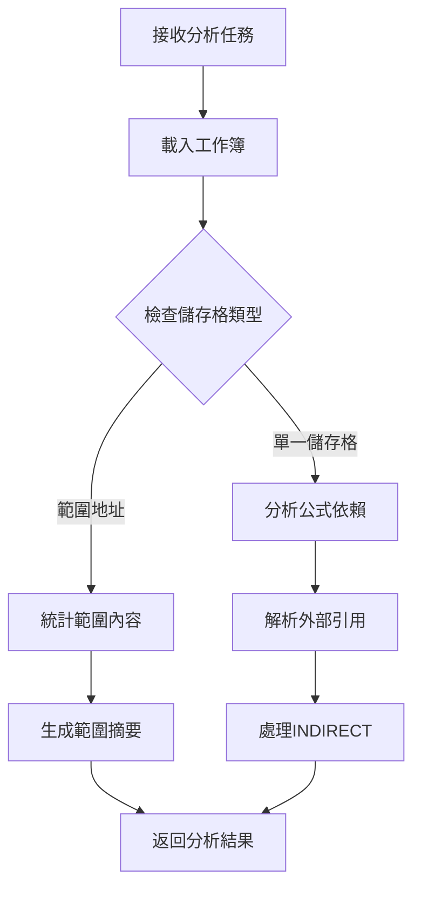

# Excel Dependency Scanner - 技術架構分析

## 🏗️ 系統架構概覽

```
┌─────────────────────────────────────────────────────────┐
│                    用戶界面層 (UI Layer)                    │
├─────────────────────────────────────────────────────────┤
│  tkinter GUI  │  顯示控制  │  事件處理  │  格式化輸出      │
└─────────────────────────────────────────────────────────┘
                              │
┌─────────────────────────────────────────────────────────┐
│                   業務邏輯層 (Business Layer)              │
├─────────────────────────────────────────────────────────┤
│  依賴分析引擎  │  公式解析器  │  路徑解析器  │  快取管理     │
└─────────────────────────────────────────────────────────┘
                              │
┌─────────────────────────────────────────────────────────┐
│                   數據存取層 (Data Layer)                  │
├─────────────────────────────────────────────────────────┤
│   openpyxl    │  formulas庫  │ workbook_resolver │ win32com │
└─────────────────────────────────────────────────────────┘
                              │
┌─────────────────────────────────────────────────────────┐
│                   檔案系統層 (File System)                 │
├─────────────────────────────────────────────────────────┤
│    Excel檔案   │   外部連結   │   工作表數據   │   公式內容   │
└─────────────────────────────────────────────────────────┘
```

---

## 🔧 核心組件分析

### **A. 依賴分析引擎 (Dependency Analysis Engine)**

#### **1. 主要函數架構**
```python
def trace_dependency_vine(task, working_path):
    """
    核心依賴分析函數
    
    輸入：
    - task: {"file": path, "sheet": name, "cell": address}
    - working_path: 工作目錄路徑
    
    輸出：
    - normalized_parts: 依賴列表
    - is_formula: 是否為公式
    - display_content: 顯示內容
    - actual_value: 實際計算值
    """
```

#### **2. 處理流程**


#### **3. 依賴解析策略**
```python
# 1. 使用 formulas 庫獲取依賴關係
excel_model = formulas.ExcelModel().load(target_file_path)
compiled_cell_object = excel_model.cells.get(found_key)

# 2. 正則表達式解析公式引用
external_ref_pattern = r"'([^']*\\)?\[([^\]]+)\]([^']+)'!([A-Z]+\d+(?::[A-Z]+\d+)?)"
internal_ref_pattern = r"(?:'([^']+)'|([A-Za-z_][A-Za-z0-9_]*))!([A-Z]+\d+(?::[A-Z]+\d+)?)"
same_sheet_pattern = r"\b([A-Z]+\d+(?::[A-Z]+\d+)?)\b"

# 3. 構建依賴任務列表
normalized_parts = [
    {"file": absolute_path, "sheet": sheetname, "cell": cell_ref}
]
```

### **B. 檔案快取系統 (File Caching System)**

#### **1. 快取架構**
```python
# 全局快取字典
_file_cache = {}

def get_cached_workbook(file_path, data_only=False, use_resolved=False):
    """
    三層快取策略：
    1. Formula Mode: data_only=False, use_resolved=False
    2. Data Mode: data_only=True, use_resolved=False  
    3. Resolved Mode: data_only=False, use_resolved=True
    """
    cache_key = f"{file_path}_{data_only}_{use_resolved}"
    
    if cache_key not in _file_cache:
        # 載入並快取工作簿
        _file_cache[cache_key] = load_workbook(...)
    
    return _file_cache[cache_key]
```

#### **2. 記憶體管理**
```python
def clear_file_cache():
    """
    智能記憶體清理：
    1. 關閉所有開啟的工作簿
    2. 清空快取字典
    3. 釋放記憶體資源
    """
    for wb in _file_cache.values():
        try:
            wb.close()
        except:
            pass
    _file_cache.clear()
```

### **C. 路徑解析器 (Path Resolver)**

#### **1. 數字索引轉換**
```python
# 問題：Excel 內部表示
# [4]GDP11!$C$9

# 解決：路徑重建
def _resolve_formula_string(formula_str, external_link_map):
    for index_str, formatted_path in external_link_map.items():
        formula_str = re.sub(r'\[{}\]'.format(re.escape(index_str)), 
                           formatted_path, formula_str)
    return formula_str

# 結果：實際路徑
# 'C:\Users\user\Desktop\pytest\[File5_v2.xlsx]'GDP11!$C$9
```

#### **2. 外部連結映射**
```python
def _get_external_link_map(workbook):
    """
    從工作簿提取外部連結映射：
    
    輸入：openpyxl.Workbook 物件
    輸出：{
        "1": "'C:\\path\\[File1.xlsx]'",
        "2": "'C:\\path\\[File2.xlsx]'",
        ...
    }
    """
    external_link_map = {}
    for i, link in enumerate(workbook._external_links):
        target_path = link.file_link.target
        if target_path.startswith('file:///'):
            # 處理絕對路徑
            actual_path = target_path[len('file:///'):]
            dirname = os.path.dirname(actual_path)
            basename = os.path.basename(actual_path)
            external_link_map[str(i + 1)] = f"'{dirname}\\[{basename}]'"
        else:
            # 處理相對路徑
            external_link_map[str(i + 1)] = f"[{target_path}]"
    
    return external_link_map
```

### **D. 範圍分析器 (Range Analyzer)**

#### **1. 範圍檢測邏輯**
```python
if isinstance(cell_obj, tuple):
    # openpyxl 對範圍地址返回 tuple
    rows = len(cell_obj)
    cols = len(cell_obj[0]) if rows > 0 else 0
    
    # 初始化統計變數
    total_sum = 0
    numeric_cells_count = 0
    error_cells_count = 0
    text_cells_count = 0
    hash_content_string = ""
```

#### **2. 內容分類算法**
```python
for row_of_cells in cell_obj:
    for cell in row_of_cells:
        value = cell.value
        
        if isinstance(value, (int, float)):
            # 數值類型
            total_sum += value
            numeric_cells_count += 1
            
        elif isinstance(value, str):
            if value.startswith('#'):
                # 錯誤類型 (#REF!, #VALUE!, #DIV/0! 等)
                error_cells_count += 1
            else:
                # 文字類型
                text_cells_count += 1
        
        # 建立內容指紋
        if isinstance(value, ArrayFormula):
            hash_content_string += "ArrayFormula||"
        else:
            hash_content_string += ("" if value is None else str(value)) + "||"
```

#### **3. 摘要生成策略**
```python
# 優先級排序的摘要生成
if numeric_cells_count > 0:
    summary_str = f" [Sum: {total_sum:,.2f}]".replace('.00', '')
elif error_cells_count > 0:
    summary_str = f" [Errors: {error_cells_count}]"
elif text_cells_count > 0:
    summary_str = " [Text]"
else:
    summary_str = " [Empty]"

# SHA256 內容指紋
sha256_hash = hashlib.sha256(hash_content_string.encode('utf-8')).hexdigest()
hash_str = f" [Hash: {sha256_hash[:8]}...]"

# 最終顯示格式
display_content = f"[{rows}R x {cols}C]{summary_str}{hash_str}"
```

---

## 🔄 數據流分析

### **A. 主要數據流向**

```
用戶選擇儲存格
        │
        ▼
get_active_excel_info()
        │
        ▼
trace_dependency_vine()
        │
        ▼
┌─────────────────┐
│  載入工作簿      │ ← get_cached_workbook()
│  (三種模式)      │
└─────────────────┘
        │
        ▼
┌─────────────────┐
│  解析公式依賴    │ ← formulas.ExcelModel()
│  (使用formulas庫) │
└─────────────────┘
        │
        ▼
┌─────────────────┐
│  處理外部引用    │ ← workbook_resolver
│  (數字路徑轉換)   │
└─────────────────┘
        │
        ▼
┌─────────────────┐
│  遞歸分析依賴    │ ← process_task_recursively()
│  (深度優先搜索)   │
└─────────────────┘
        │
        ▼
┌─────────────────┐
│  格式化輸出      │ ← 樹狀結構顯示
│  (視覺化展示)     │
└─────────────────┘
```

### **B. 錯誤處理流程**

```python
try:
    # 主要處理邏輯
    wb_openpyxl = get_cached_workbook(target_file_path, data_only=False)
    if wb_openpyxl is None:
        return [], False, f"❌ Could not load file: {target_file_path}", None
    
    # 繼續處理...
    
except Exception as e:
    # 統一錯誤處理
    return [], False, f"❌ Error during analysis: {e}", None
```

---

## 🎨 用戶界面架構

### **A. tkinter GUI 組件結構**

```
root (主視窗)
├── frame (主框架)
    ├── main_pane (水平分割面板)
        ├── left_frame (左側面板)
        │   ├── mode_left_frame (模式控制)
        │   ├── font_control_left_frame (字體控制)
        │   ├── summary_left_frame (摘要顯示)
        │   ├── line_number_left_frame (行號顯示)
        │   └── output_left (主要輸出區域)
        │
        └── right_frame (右側面板)
            ├── mode_right_frame (模式控制)
            ├── font_control_right_frame (字體控制)
            ├── summary_right_frame (摘要顯示)
            ├── line_number_right_frame (行號顯示)
            └── output_right (主要輸出區域)
```

### **B. 事件處理機制**

```python
# 掃描按鈕事件
def do_left_scan():
    file_path, sheet_name, cell_address = get_active_excel_info()
    left_scan_task = {"file": file_path, "sheet": sheet_name, "cell": cell_address}
    refresh_left_result(file_path, sheet_name, cell_address)

# 顯示模式切換事件
display_mode_left_var = tk.StringVar(value="simple")
tk.Radiobutton(..., variable=display_mode_left_var, value="simple", 
               command=lambda: refresh_left_result(...))

# 字體調整事件
def update_font_config_left():
    new_size = font_size_left_var.get()
    new_style = font_style_left_var.get()
    output_left.config(font=(new_style, new_size))
    # 更新所有標籤樣式...
```

---

## 🔌 外部依賴與整合

### **A. 核心依賴庫**

#### **1. openpyxl**
```python
# 用途：Excel 檔案讀寫
# 功能：
# - 讀取 .xlsx/.xlsm 檔案
# - 存取儲存格值和公式
# - 處理工作表和工作簿
# - 外部連結資訊提取

import openpyxl
wb = openpyxl.load_workbook(filename=file_path, data_only=False)
```

#### **2. formulas 庫**
```python
# 用途：公式依賴分析
# 功能：
# - 解析 Excel 公式語法
# - 建立依賴關係圖
# - 支援複雜公式結構

import formulas
excel_model = formulas.ExcelModel().load(file_path)
```

#### **3. win32com.client**
```python
# 用途：Excel 應用程式整合
# 功能：
# - 獲取當前活動儲存格
# - 與正在運行的 Excel 互動
# - 即時分析功能

import win32com.client
excel = win32com.client.GetObject(Class="Excel.Application")
```

#### **4. 自定義 workbook_resolver**
```python
# 用途：數字路徑解析
# 功能：
# - 解析外部連結索引
# - 轉換數字路徑為實際路徑
# - 提供 ResolvedWorkbookView

from workbook_resolver import load_resolved_workbook
```

### **B. 系統整合點**

#### **1. Excel 應用程式整合**
```python
def get_active_excel_info():
    """
    與運行中的 Excel 應用程式整合：
    1. 連接到 Excel COM 物件
    2. 獲取當前活動工作簿
    3. 獲取當前選中的儲存格
    4. 返回檔案路徑和位置資訊
    """
    pythoncom.CoInitialize()
    excel = win32com.client.GetObject(Class="Excel.Application")
    wb = excel.ActiveWorkbook
    ws = excel.ActiveSheet
    cell = excel.ActiveCell
    
    return wb.FullName, ws.Name, cell.Address.replace("$", "")
```

#### **2. 檔案系統整合**
```python
# 支援的檔案路徑格式：
# - 絕對路徑: C:\Users\user\Documents\File.xlsx
# - 相對路徑: ./Data/File.xlsx
# - UNC 路徑: \\server\share\File.xlsx
# - 網路路徑: https://sharepoint.com/File.xlsx (部分支援)
```

---

## 📊 效能特性分析

### **A. 時間複雜度**

#### **1. 單一儲存格分析**
- **最佳情況**: O(1) - 無依賴的值儲存格
- **平均情況**: O(n) - n 為直接依賴數量
- **最壞情況**: O(n×m) - n 為依賴數量，m 為平均依賴深度

#### **2. 範圍分析**
- **時間複雜度**: O(r×c) - r 為行數，c 為列數
- **空間複雜度**: O(r×c) - 需要載入所有儲存格內容

#### **3. 快取效能**
- **快取命中**: O(1) - 直接返回快取物件
- **快取未命中**: O(f) - f 為檔案載入時間
- **記憶體使用**: O(n×s) - n 為快取檔案數，s 為平均檔案大小

### **B. 空間複雜度**

#### **1. 記憶體使用模式**
```python
# 主要記憶體消耗：
# 1. 檔案快取: _file_cache
# 2. 依賴樹結構: normalized_parts
# 3. GUI 顯示緩存: text_widget content
# 4. formulas 庫內部結構: excel_model
```

#### **2. 記憶體優化策略**
```python
# 1. 自動快取清理
clear_file_cache()  # 掃描完成後釋放

# 2. 循環引用檢測
if task_identifier in current_path:
    return  # 避免無限遞歸

# 3. 智能工作簿關閉
try:
    wb.close()
except:
    pass
```

---

## 🛡️ 安全性與穩定性

### **A. 錯誤處理策略**

#### **1. 分層錯誤處理**
```python
# Level 1: 函數級錯誤處理
try:
    result = trace_dependency_vine(task, working_path)
except Exception as e:
    return [], False, f"❌ Error during analysis: {e}", None

# Level 2: 操作級錯誤處理  
try:
    wb = get_cached_workbook(file_path)
    if wb is None:
        return error_result
except Exception as e:
    log_error(e)
    return fallback_result

# Level 3: 系統級錯誤處理
def safe_operation():
    try:
        return risky_operation()
    except:
        return safe_fallback()
```

#### **2. 資源管理**
```python
# 自動資源清理
def clear_file_cache():
    for wb in _file_cache.values():
        try:
            wb.close()  # 確保檔案正確關閉
        except:
            pass  # 忽略關閉錯誤
    _file_cache.clear()

# 記憶體洩漏防護
finally:
    if wb_openpyxl:
        wb_openpyxl.close()
```

### **B. 輸入驗證**

#### **1. 檔案路徑驗證**
```python
# 檢查檔案存在性
if not os.path.exists(file_path):
    return error_result

# 檢查檔案格式
if not file_path.lower().endswith(('.xlsx', '.xlsm')):
    return format_error_result
```

#### **2. 儲存格地址驗證**
```python
# 驗證儲存格地址格式
cell_pattern = re.compile(r'^[A-Z]+\d+$')
if not cell_pattern.match(cell_address):
    return invalid_address_error
```

---

## 🔮 擴展性設計

### **A. 模組化架構**

#### **1. 核心模組分離**
```python
# 依賴分析核心
class DependencyAnalyzer:
    def analyze(self, task): pass
    def get_dependencies(self, cell): pass

# 路徑解析模組  
class PathResolver:
    def resolve_external_links(self, formula): pass
    def convert_numeric_paths(self, formula): pass

# 快取管理模組
class CacheManager:
    def get_workbook(self, path, mode): pass
    def clear_cache(self): pass
```

#### **2. 插件接口設計**
```python
# 自定義分析器接口
class CustomAnalyzer:
    def can_handle(self, cell_type): pass
    def analyze(self, cell_obj): pass
    def format_result(self, result): pass

# 註冊機制
analyzer_registry = []
def register_analyzer(analyzer):
    analyzer_registry.append(analyzer)
```

### **B. 配置系統**

#### **1. 設定檔支援**
```python
# config.yaml
display:
  default_mode: "simple"
  font_family: "Consolas"
  font_size: 10

performance:
  cache_size_limit: 100
  max_recursion_depth: 50
  
analysis:
  include_indirect: true
  resolve_external_links: true
```

#### **2. 運行時配置**
```python
class Config:
    def __init__(self):
        self.load_from_file("config.yaml")
    
    def get(self, key, default=None):
        return self.config.get(key, default)
    
    def set(self, key, value):
        self.config[key] = value
        self.save_to_file()
```

---

## 📋 總結

這個 Excel Dependency Scanner 展現了優秀的技術架構設計：

### **架構優勢**
- ✅ **模組化設計**: 清晰的分層架構
- ✅ **高效能**: 智能快取和記憶體管理
- ✅ **穩定性**: 完善的錯誤處理機制
- ✅ **擴展性**: 支援插件和自定義分析器
- ✅ **用戶友好**: 直觀的 GUI 和視覺化

### **技術特色**
- 🔧 **多模式檔案讀取**: 支援不同的分析需求
- 🚀 **智能快取系統**: 大幅提升重複分析效能
- 🎯 **精確依賴追蹤**: 支援複雜的 Excel 引用結構
- 🛡️ **健壯錯誤處理**: 優雅處理各種異常情況

這是一個技術成熟、功能完整的專業級工具。